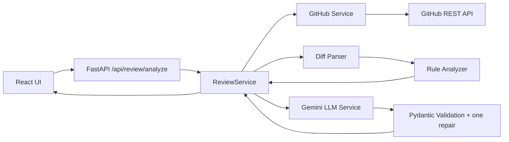

# AI CodeReview

AI CodeReview is a focused FastAPI and React application for reviewing public GitHub pull requests. It combines predictable rule checks with Gemini-assisted reasoning and returns a validated, structured review. It is not an autonomous agent: it does not execute code, call tools on behalf of a model, modify repositories, or use RAG.

## Problem statement

Pull-request review needs both fast checks for obvious patterns and judgment about code flow. Regex can reliably spot a hardcoded secret or `console.log`, but it cannot reliably assess an inverted condition or missing error path. This project keeps those concerns separate and makes model output a validated input, not an authority.

## Features

- Public GitHub PR URL validation and read-only GitHub API retrieval
- Unified-diff parsing with added-line locations
- Deterministic checks for debug logging, `print`, TODO/FIXME, hardcoded secrets, and long lines
- Gemini reasoning review for logic, conditions, error handling, performance, and maintainability
- Strict Pydantic response contract and exactly one correction retry
- Safe size limits, binary/no-patch skipping, and visible partial-analysis warnings
- Professional React result UI with severity grouping and optional text-only diff preview

## Architecture



## Complete request flow

1. The user enters a URL; the React API layer sends it to `POST /api/review/analyze`.
2. The backend accepts only `https://github.com/{owner}/{repo}/pull/{number}` and calls the fixed GitHub API host.
3. `ReviewService` fetches PR metadata/files, applies file and total-diff limits, parses patches, skips binary/missing-patch detail, and runs rules.
4. It sends bounded title, description, changed files/diff, and existing rule findings to Gemini. Added and removed lines are placed before unchanged context so truncation preserves changed code.
5. Gemini must produce review JSON. Pydantic rejects malformed JSON, missing/extra fields, invalid enums, and incorrect scalar types. Empty findings remain valid.
6. One validation failure gets one format-correction request; a second failure becomes a safe `503`.
7. Static and LLM findings are deduplicated and returned with summary, status, warnings, and a limited raw-diff preview.

## Tech stack

- Backend: Python 3.12, FastAPI, Pydantic, httpx, Google Gemini SDK
- Frontend: React, Vite, Tailwind CSS
- Runtime packaging: Docker Compose, Nginx static frontend proxy
- Tests: pytest with fake GitHub and Gemini boundaries

## Analysis design

### Rule-based analysis

Rules are deterministic, cheap, and testable: `console.log`, `print`, TODO/FIXME/HACK, likely hardcoded secrets, and lines over 120 characters. They inspect only added lines, avoiding reports for code that a PR removes.

### LLM analysis

The trusted system instruction establishes a code-review role, requires evidence, tells Gemini never to execute code, and treats all titles, descriptions, comments, strings, and diffs as untrusted data. It explicitly rejects instructions embedded in code. The LLM focuses on reasoning—logic bugs, suspicious conditions, incomplete error handling, inefficient flow, and maintainability—not simple pattern matching.

Because a diff lacks complete application context, model findings should state “potential issue”, “may”, or “could” rather than make unsupported certainty claims.

### Structured output and bounded retry

JSON prompting alone is not a guarantee. The `ReviewResponse` and `Finding` Pydantic models validate severity/category/status enums, fields, and scalar types before output reaches the frontend. A single correction attempt makes common formatting errors recoverable without unlimited latency, spend, or repeated failure loops.

## Security considerations

- **Untrusted content:** PR text is delimited and analysed only; neither backend nor model is asked to execute it.
- **Prompt injection:** system policy is structurally separate from untrusted PR content; comments and strings never outrank it. This reduces but cannot eliminate LLM manipulation risk.
- **SSRF:** input URLs are allowlisted and the backend does not fetch the submitted URL directly; it constructs requests only to `api.github.com`.
- **Secrets:** Gemini/GitHub keys live only in backend environment variables. Never create a `VITE_` secret or commit `.env`.
- **Abuse and size:** GitHub calls are read-only and time-limited; file, diff, and LLM-input caps limit API and model cost. A public deployment should additionally add edge rate limiting.
- **Errors:** upstream details are logged server-side; the browser gets safe messages.

## GitHub integration and realistic PR sizes

The application processes at most `MAX_REVIEW_FILES` files (default 50), at most `MAX_TOTAL_DIFF_CHARS` raw diff characters (200,000), and sends at most `MAX_LLM_DIFF_CHARS` (40,000) to Gemini. It reports a warning whenever files/diff are skipped or truncated, and marks binary/no-patch files as unavailable for detailed analysis.

LLM context limits matter because whole large PRs increase cost and latency, dilute attention, and can exceed a model’s practical context budget. These caps trade completeness for predictable response time and cost. A later production design could prioritize files by risk or split review work and aggregate it, but this project deliberately does not add chunking, queues, RAG, embeddings, or background infrastructure.

## Testing strategy

Unit tests isolate deterministic components: URL parsing/error mapping, patch parsing (added/deleted/modified/binary/no-patch), rules, Pydantic response validation, response repair, and review-service orchestration. GitHub tests substitute a fake `httpx` client; Gemini tests substitute a fake SDK/model. Normal tests never call GitHub or Gemini.

Integration tests verify module boundaries such as the GitHub service’s HTTP-to-domain-error mapping and the full orchestrator using mocked external services. A real staging smoke test can separately verify credentials and live APIs, but it should not be part of the routine suite because networks, quotas, API behaviour, and LLM output are variable.

Run backend tests:

```bash
cd backend
python -m pytest tests -q
```

LLM applications are hard to test deterministically: identical prompts can vary by model/version, a diff lacks repository context, and “correct review” can be subjective. False positives are reported issues that are not real problems; false negatives are expected issues that were missed.

## Evaluation methodology

`backend/evaluation/dataset.json` contains 12 small, hand-curated diffs covering rules, semantic issues, clean code, removed debug code, and an injection-text control. The offline runner evaluates static results independently and can score recorded, human-reviewed LLM results separately:

```bash
cd backend
python evaluation/evaluate.py
# Optional: python evaluation/evaluate.py --llm-results recorded_llm_results.json
```

It writes `backend/evaluation/report.json`, showing category/severity matches plus false positives and negatives. The small fixture set is useful for regression detection, not proof of correctness, coverage of real repositories, security, or model accuracy.

## Run locally with Docker

1. Copy `.env.example` to `.env` and set `GEMINI_API_KEY`. Optionally set `GITHUB_TOKEN` for higher GitHub limits.
2. Run:

```bash
docker compose up --build
```

3. Open `http://localhost:8080`.

Docker gives each dependency a repeatable environment. The backend container owns secrets and API calls; the frontend container builds static React assets and Nginx proxies `/api` privately to the backend. Neither `.env`, API keys, local virtual environments, node modules, test caches, nor source-control credentials are copied into an image.

For non-Docker development, start FastAPI from `backend` and Vite from `frontend`; set `VITE_API_URL=http://localhost:8000` only for the browser-visible API location, never for secrets.

## Environment variables

| Variable | Required | Purpose |
| --- | --- | --- |
| `GEMINI_API_KEY` | Yes for AI review | Backend-only Gemini credential |
| `GITHUB_TOKEN` | No | Backend-only GitHub token; raises GitHub API quota |
| `FRONTEND_ORIGIN` | No | Allowed browser origin; Docker defaults to `http://localhost:8080` |
| `MAX_REVIEW_FILES` | No | Changed-file processing cap |
| `MAX_TOTAL_DIFF_CHARS` | No | Total parsed diff cap |
| `MAX_LLM_DIFF_CHARS` | No | Gemini diff-input cap |

## Screenshots

<!-- Add screenshots after running the UI locally. -->

- `[Screenshot placeholder: PR URL input and loading state]`
- `[Screenshot placeholder: structured findings and severity groups]`
- `[Screenshot placeholder: truncation warning and raw diff preview]`

## Limitations and future improvements

- Only public GitHub PRs are supported; very large/binary/no-patch files may be skipped.
- Model findings are suggestions, not verified bugs or security guarantees.
- The app is synchronous and intentionally has no persistent review history or rate limiter.
- Potential future work: user-facing GitHub auth, edge rate limiting, risk-based file selection, repository-aware review context, real staging contract tests, and measured evaluation across a larger labelled corpus.
